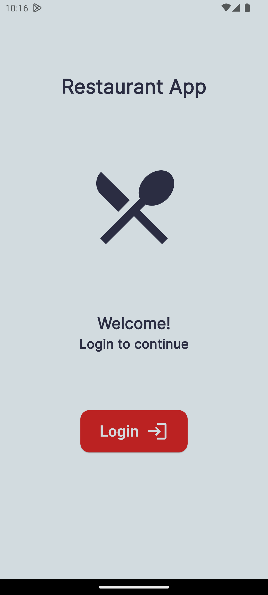
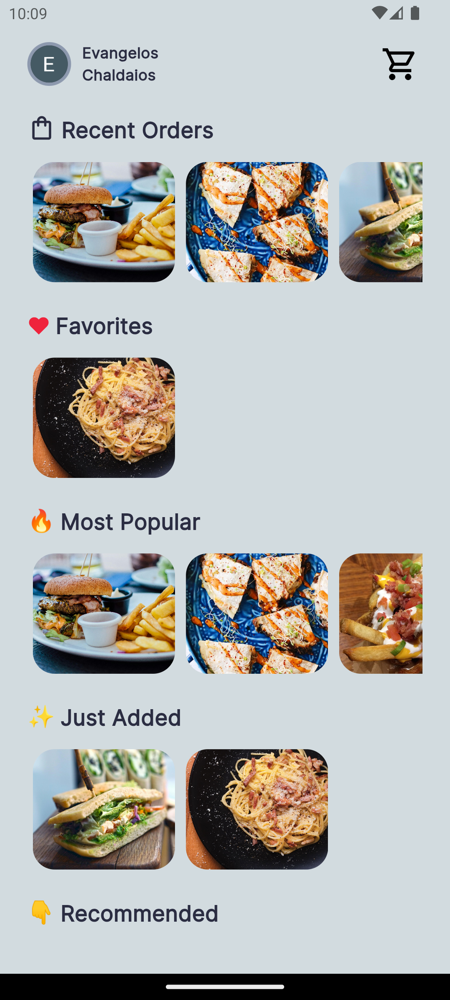
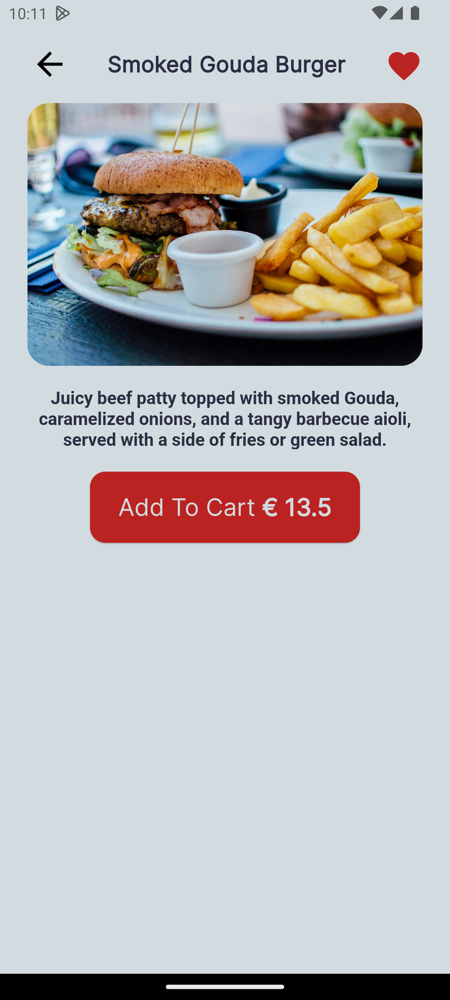
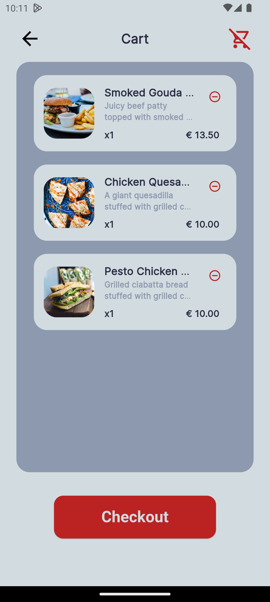
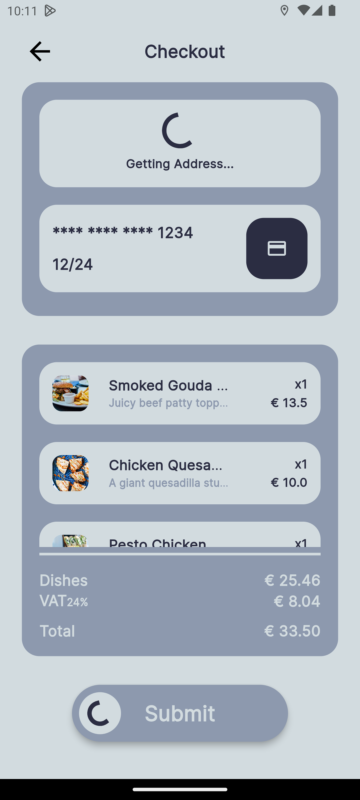
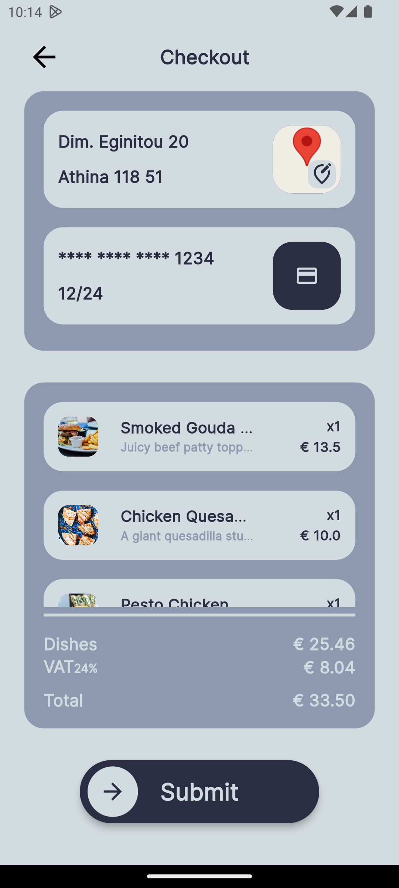
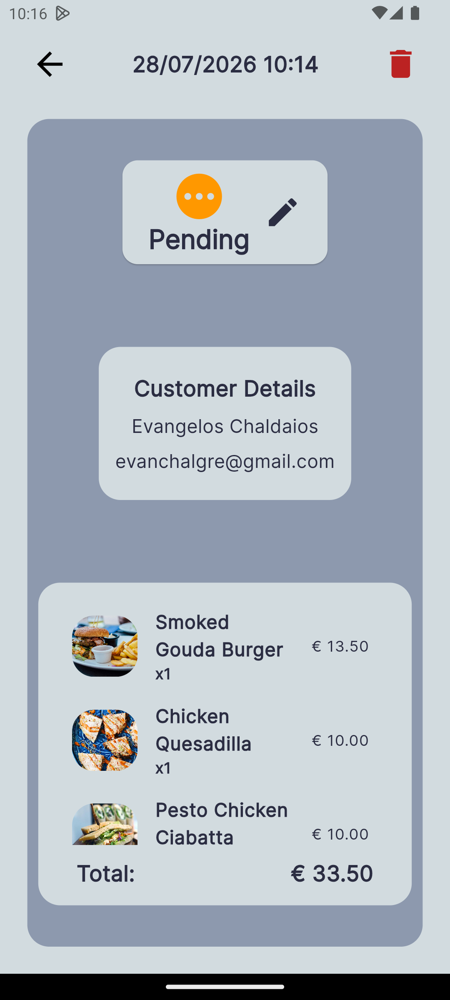
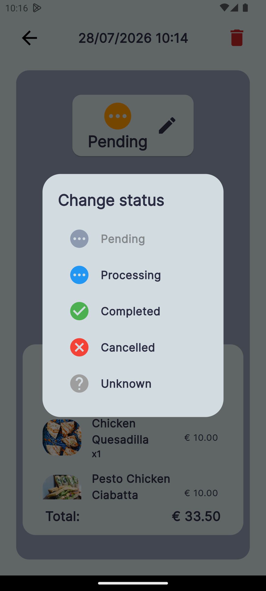

# Restaurant App

A simple and intuitive restaurant management application for browsing menus, placing orders, and managing orders.

## Features

- Browse restaurant menus and items
- Place and manage orders
- User-friendly interface

## Screenshots

<table border="0" cellpadding="0" cellspacing="0" width="100%">
  <tr>
    <td align="center" valign="top">
      <h4>Login Screen</h4>
      
    </td>
    <td align="center" valign="top">
      <h4>Home Screen</h4>
      
    </td>
  </tr>
  <tr>
    <td align="center" valign="top">
      <h4>Menu Browser</h4>
      
    </td>
    <td align="center" valign="top">
      <h4>Cart Screen</h4>
      
    </td>
  </tr>
  <tr>
    <td align="center" valign="top">
      <h4>Address Fetch</h4>
      
    </td>
    <td align="center" valign="top">
      <h4>Order Checkout</h4>
      
    </td>
  </tr>
  <tr>
    <td align="center" valign="top">
      <h4>Order Overview (Admin View)</h4>
      
    </td>
    <td align="center" valign="top">
      <h4>Order Status (Admin View)</h4>
      
    </td>
  </tr>
</table>